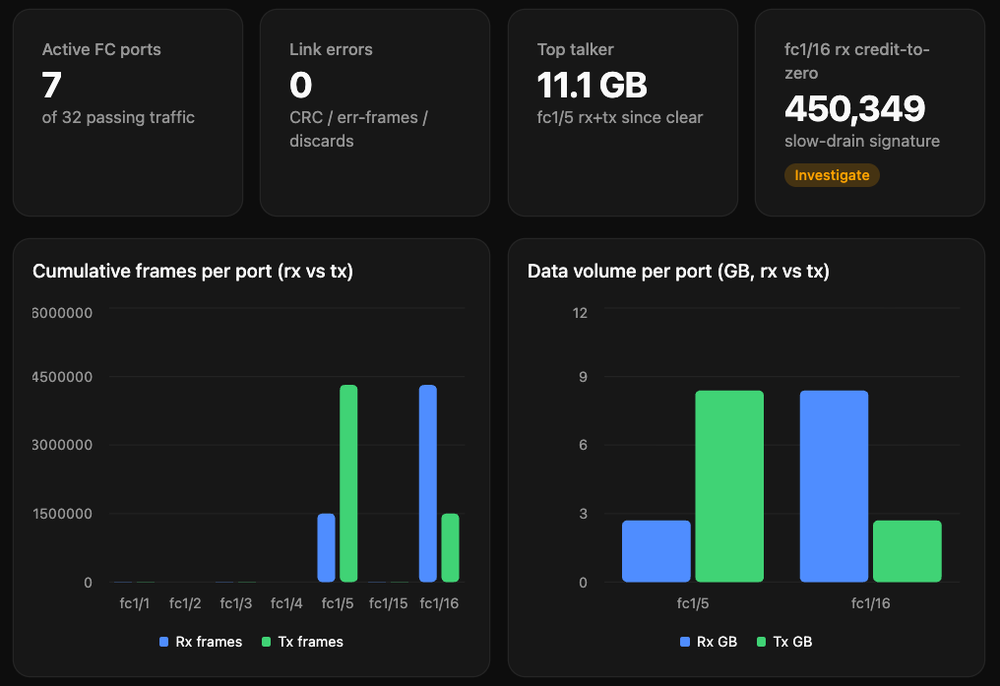

# MDS MCP server

A lightweight [FastMCP](https://github.com/jlowin/fastmcp) server that exposes
**read-only** Cisco MDS NX-OS `show` commands as [Model Context Protocol](https://modelcontextprotocol.io) tools. Point it at one or many MDS switches and let an LLM client (VS Code, Claude, a LangChain agent, etc) inspect your SAN fabric in plain language.

- **Read-only & safe** — every tool maps to a `show` command over NX-API (JSON-RPC).
- **Multi-switch** — register as many switches as you want; clients pick one per call.
- **Two transports** — `stdio` or `http`.
- **63 tools** spanning zoning, device-aliases, FLOGI/FCNS, VSANs, interfaces, port-channels, transceivers, counters, environment, logging, and inventory.
- **Generative UI** — in MCP-Apps-capable clients, the model can turn `show` output into live charts, tables, and dashboards on the fly.

## Requirements

- Python **3.13+**
- [`uv`](https://docs.astral.sh/uv/)
- Cisco MDS switch(es) with **NX-API** enabled (`feature nxapi`)

## Configuration

Switches are declared with **indexed environment variables**. Add more by repeating the
block with the next number (gaps are tolerated):

| Variable | Required | Default | Description |
|---|---|---|---|
| `MCP_TRANSPORT` | | `http` | `stdio` or `http` |
| `MCP_HOST` | | `0.0.0.0` | HTTP bind address |
| `MCP_PORT` | | `8000` | HTTP bind port |
| `MDS_<N>_HOST` | ✅ | — | Switch IP or hostname |
| `MDS_<N>_USERNAME` | ✅ | — | NX-API username |
| `MDS_<N>_PASSWORD` | ✅ | — | NX-API password |
| `MDS_<N>_NAME` | | the host | Friendly name used by the `switch` argument |
| `MDS_<N>_PORT` | | `8443` | NX-API HTTPS port |
| `MDS_<N>_VERIFY_SSL` | | `false` | Verify the TLS certificate |

```dotenv
MDS_1_NAME=mds-fab-a
MDS_1_HOST=192.0.2.10
MDS_1_USERNAME=admin
MDS_1_PASSWORD=secret

MDS_2_NAME=mds-fab-b
MDS_2_HOST=192.0.2.11
MDS_2_USERNAME=admin
MDS_2_PASSWORD=secret
```

Copy [.env.example](.env.example) to `.env` and fill it in. On startup the server reads
this `.env` file, so you don't have to export the variables by hand. Variables set in the
actual environment (shell, Docker, or an MCP client's `env` block) take precedence over `.env`.

## Run

Install dependencies once, then start the server:

```bash
uv sync                 # create the virtualenv and install dependencies

uv run python main.py   # start the server (defaults to HTTP on http://localhost:8000/mcp)
```

To use stdio instead of HTTP, set `MCP_TRANSPORT=stdio` — either in `.env` (`MCP_TRANSPORT=stdio`)
or inline for a single run:

```bash
MCP_TRANSPORT=stdio uv run python main.py
```

### Docker / Podman

Build the image, then run it with your `.env` providing the switch credentials. The commands
below use `docker`; replace it with `podman` if you prefer (the syntax is identical):

```bash
docker build -t mds-mcp .
docker run --rm -p 8000:8000 --env-file .env mds-mcp   # HTTP on http://localhost:8000/mcp
```

## Using it from a client (Visual Studio Code)

Using **Visual Studio Code** here for the example, but any LLM client that supports MCP will work more or less the same way.

You register the server in a `mcp.json` file: `.vscode/mcp.json` for this workspace only,
or your **user** `mcp.json` (Command Palette → *MCP: Open User Configuration*) to use it
everywhere. Pick **one** of the two options below, paste it into that file, then open the
Command Palette → *MCP: List Servers* → `cisco-mds` → **Start**.

### Option A — HTTP
You run the server yourself; VS Code just connects to it.

1. Configure your switches in `.env` (see [Configuration](#configuration)).
2. Start the server: `uv run python main.py`.
3. Add this to `mcp.json`:

```json
{
  "servers": {
    "cisco-mds": { "type": "http", "url": "http://localhost:8000/mcp" }
  }
}
```

### Option B — stdio
VS Code launches the process for you. Set `cwd` to where you cloned the
repo so the server finds your `.env`. The `env` block below is optional — use it only to set
or override variables without an `.env` file (remember it takes precedence over `.env`).

```json
{
  "servers": {
    "cisco-mds": {
      "type": "stdio",
      "command": "uv",
      "args": ["run", "python", "main.py"],
      "cwd": "/path/to/mds-mcp",
      "env": {
        "MCP_TRANSPORT": "stdio",
        "MDS_1_HOST": "192.0.2.10",
        "MDS_1_USERNAME": "admin",
        "MDS_1_PASSWORD": "secret"
      }
    }
  }
}
```

Once started, open Copilot Chat and the `cisco-mds` tools become available to the model.

## Usage

Ask the model questions in plain language about your SAN fabric. Examples:

- "List the configured switches and their software version."
- "Which zones are active in VSAN 20 on mds-fab-a?"
- "Show me the FLOGI database on both switches."
- "List all device aliases and tell me which ones aren't logged in right now."
- "Resolve pwwn `50:00:00:00:00:00:00:01` to a device alias and show its FCNS entry."
- "Are there any interfaces with CRC errors or link failures on mds-fab-b?"
- "Compare the transceiver Rx/Tx power on all fc interfaces and flag anything below -7 dBm."
- "Which ports are members of port-channel 220, and what's their negotiated speed?"
- "Show the traffic counters for interface fc1/3 — how much is it sending vs receiving?"
- "Which interfaces are seeing the most txwait or discarded frames on mds-fab-a?"
- "Summarize the VSAN membership across both fabrics."
- "Check the environment and module status — any failed fans, power supplies, or modules?"

## Tool catalog

All tools are read-only.

| Area | Tools |
|---|---|
| Discovery | `list_switches` |
| Zoning | `show_zone`, `show_zone_active`, `show_zone_name`, `show_zone_vsan`, `show_zone_name_vsan`, `show_zone_status`, `show_zoneset`, `show_zoneset_active`, `show_zoneset_active_vsan`, `show_zoneset_name`, `show_zoneset_vsan`, `show_zoneset_name_vsan` |
| Devices Aliases | `show_device_alias_database`, `show_device_alias_name`, `show_device_alias_pwwn` |
| System / Inventory | `show_hardware`, `show_version`, `show_inventory`, `show_module`, `show_module_uptime`, `show_boot`, `show_switchname`, `show_cdp_neighbors`, `show_hosts`, `show_environment` |
| Interfaces and Port-Channels (all) | `show_interface_brief`, `show_interface_bbcredit`, `show_interface_transceiver`, `show_interface_transceiver_detail`, `show_interface_description`, `show_interface_mgmt`, `show_port_channel_summary`, `show_port_channel_usage` |
| Interface detail (per-port) | `show_running_config_interface_for`, `show_interface_for`, `show_interface_brief_for`, `show_interface_bbcredit_for`, `show_interface_transceiver_for`, `show_interface_transceiver_detail_for`, `show_interface_description_for` |
| Flogi / Name Server / Login | `show_flogi_database`, `show_flogi_database_for`, `show_flogi_database_vsan`, `show_fcns_database`, `show_fcns_database_vsan`, `show_fcns_database_detail` |
| VSAN | `show_vsan`, `show_vsan_id`, `show_vsan_usage`, `show_vsan_membership`, `show_vsan_membership_for` |
| Interface Counters | `show_interface_counters`, `show_interface_counters_brief`, `show_interface_counters_for`, `show_interface_counters_brief_for`, `show_interface_counters_detailed_for`, `show_interface_aggregate_counters_for` |
| Sessions / Users | `show_users`, `show_accounting_log` |
| Logging | `show_logging` |
| Generative UI | `generate_prefab_ui`, `search_prefab_components` |

## Generative UI

The server registers FastMCP's [`GenerativeUI`](https://gofastmcp.com/apps/generative)
provider, which exposes two extra tools: `generate_prefab_ui` and
`search_prefab_components`. In a client that supports [MCP Apps](https://modelcontextprotocol.io/docs/extensions/apps),
the model can take the raw JSON from any `show` tool and render it as an
interactive [Prefab](https://prefab.prefect.io/) view — bar/pie charts,
sortable tables, KPI cards, and full dashboards — without any purpose-built UI
tool. For example:

- "Query the interface brief on mds-fab-a and chart the ports per VSAN."
- "Build a dashboard of interface performance counters for mds-fab-b."
- "Show the FCNS database as a sortable table grouped by VSAN."



Clients without MCP-Apps support still get the underlying `show` data as JSON.

## Disclaimer

A personal project, not affiliated with or endorsed by Cisco.
